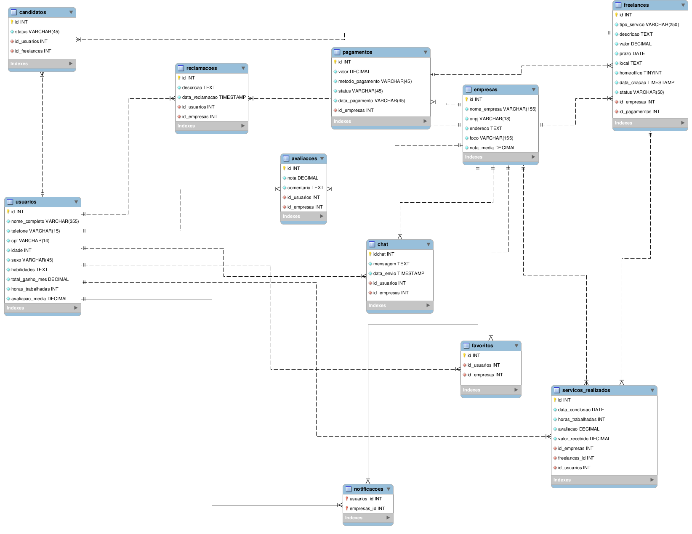

# Projeto Integrador — Plataforma de Conexão entre Freelancers de TI e Empresas

## Descrição do Projeto

Este projeto tem como objetivo desenvolver um *site e aplicativo voltados para a promoção de serviços freelancers na área de Tecnologia da Informação (TI)*, conectando profissionais de tecnologia a pessoas e empresas que buscam soluções digitais.

A plataforma permitirá que *freelancers de TI* cadastrem seus perfis, adicionem suas habilidades técnicas e encontrem oportunidades de trabalho compatíveis com suas competências. Ao mesmo tempo, empresas poderão cadastrar *projetos de desenvolvimento, suporte técnico, design digital, análise de dados e outros serviços de tecnologia*, facilitando a contratação de profissionais qualificados.

Além disso, o sistema oferecerá recursos que tornam o processo de contratação mais seguro e transparente, como *avaliações, histórico de projetos, chat entre usuários e controle de horas trabalhadas*.

A proposta busca *valorizar o trabalho independente na área de tecnologia*, ampliar a visibilidade dos profissionais de TI e facilitar o acesso a serviços tecnológicos de maneira rápida, prática e confiável.

---

## Situação Problema

Atualmente, muitos profissionais freelancers da área de *Tecnologia da Informação* enfrentam dificuldades para encontrar oportunidades de trabalho de forma organizada e confiável. Em muitos casos, a divulgação de serviços ocorre de maneira informal, principalmente por redes sociais, grupos ou indicações, o que limita o alcance desses profissionais e dificulta a construção de uma reputação sólida no mercado.

Por outro lado, empresas e empreendedores que precisam contratar *desenvolvedores, designers, especialistas em suporte técnico ou profissionais de tecnologia para projetos específicos* também enfrentam dificuldades para encontrar profissionais qualificados de forma rápida e segura.

A ausência de plataformas acessíveis que conectem diretamente essas duas partes pode gerar perda de tempo, falta de transparência nas negociações e insegurança durante a contratação.

Além disso, muitas dessas contratações não possuem ferramentas adequadas para acompanhar aspectos importantes do trabalho freelancer, como *controle de horas trabalhadas, histórico de projetos, avaliações entre contratante e profissional e comunicação organizada entre as partes*.

Diante desse cenário, surge a necessidade de uma plataforma especializada em *freelancers de TI*, que facilite essa conexão, oferecendo um ambiente confiável, transparente e eficiente para empresas e profissionais da área tecnológica.

---

## Descrição da Proposta

A proposta do projeto é criar uma *plataforma digital que conecte freelancers de TI e empresas*, permitindo que projetos tecnológicos sejam divulgados e preenchidos de maneira rápida e eficiente.

---

## Cadastro de Usuários'        

No momento do cadastro, o usuário poderá escolher entre dois perfis.

### Freelancer de TI

- Nome completo  
- Telefone  
- CPF (informação privada)  
- Idade  
- Sexo (opcional)  
- Área de atuação (ex.: desenvolvimento web, design UI/UX, suporte técnico, análise de dados, segurança da informação)  
- Tecnologias dominadas (ex.: JavaScript, Python, React, SQL)

### Empresa

- Nome da empresa  
- CNPJ  
- Endereço  
- Área de atuação (ex.: startup, e-commerce, empresa de tecnologia, agência digital)

---

## Funcionalidades para Empresas

- Cadastro de *projetos ou demandas de TI*
- Definição de valor por projeto ou por hora
- Definição de prazo para entrega
- Descrição detalhada do projeto
- Tecnologias necessárias para execução
- Seleção do freelancer ideal
- Histórico de projetos contratados

### Dashboard da Empresa

- Total investido em projetos
- Avaliação média dos freelancers contratados

---

## Funcionalidades para Freelancers

- Busca por *projetos de TI compatíveis com suas habilidades*
- Sistema de filtro de vagas por:
- Valor do projeto ou hora
- Avaliação da empresa
- Tipo de projeto
- Tecnologia utilizada
- Prazo de entrega
- Histórico de projetos realizados
- Portfólio com trabalhos anteriores

### Dashboard do Freelancer

- Total ganho no mês
- Projetos concluídos
- Avaliação média recebida

## Recursos da Plataforma

- Sistema de *login e autenticação*
- *Menu de categorias de tecnologia*
- *Barra de pesquisa com filtros inteligentes*
- *Chat interno* entre freelancers e empresas
- *Sistema de avaliação com estrelas e comentários*
- *Contratos digitais automáticos*
- Encerramento automático de vagas
- Página de *denúncias e suporte*
- *Sistema de portfólio profissional*
- Upload de *arquivos do projeto*

---

## Sistema de Controle de Trabalho

- O freelancer poderá iniciar um *cronômetro de trabalho dentro da plataforma*
- O sistema registra o tempo dedicado ao projeto
- As horas trabalhadas ficam registradas no sistema
- A empresa pode acompanhar o progresso do trabalho
- A plataforma contará com um sistema de controle baseado em *registro de atividades e tempo de trabalho*:

Isso garante maior *transparência, organização e confiabilidade* no acompanhamento do desenvolvimento dos projetos.

# Regras de Negócio

As regras de negócio definem as condições e restrições que garantem o funcionamento adequado da plataforma.

**RN001** — O usuário deve escolher, no momento do cadastro, entre perfil de **freelancer** ou **empresa**, não sendo permitido possuir ambos com a mesma conta.  

**RN002** — Informações sensíveis como **CPF e CNPJ** devem ser armazenadas com segurança e não devem ser exibidas publicamente.  

**RN003** — As oportunidades de freelance devem apresentar, quando aplicável:  
- Data de entrega  
- Horário de início e fim (caso presencial)  
- Localização da empresa  
- Tipo de trabalho (home office ou presencial)  
- Valor do serviço  
- Total de horas trabalhadas  

**RN004** — O perfil do freelancer deve conter obrigatoriamente:  
- Nome completo  
- Telefone  
- Habilidades  
- Histórico de serviços  
- Avaliação média  

**RN005** — O sistema deve calcular automaticamente:  
- Total ganho no mês (freelancer)  
- Total investido (empresa)  
- Avaliações médias  

**RN006** — O freelancer poderá se candidatar apenas a projetos compatíveis com suas habilidades cadastradas.  

**RN007** — A empresa é responsável por selecionar apenas um freelancer por vaga.  

**RN008** — A vaga deve ser automaticamente encerrada quando:  
- Um candidato for selecionado, ou  
- O limite de candidatos for atingido  

**RN009** — O pagamento deve ser liberado somente após a confirmação de conclusão do serviço.  

**RN010** — O sistema deve registrar todas as interações relevantes, como:  
- Mensagens no chat  
- Avaliações  
- Horas trabalhadas  
- Conclusão de projetos  

**RN011** — O sistema de avaliação deve permitir feedback mútuo entre empresa e freelancer após a finalização do projeto.  

# Requisitos Funcionais

**RF001** — O sistema deve permitir o cadastro de usuários.  
**RF002** — O sistema deve permitir login e autenticação.  
**RF003** — O sistema deve permitir a busca de oportunidades de freelance.  
**RF004** — O sistema deve exibir informações detalhadas das oportunidades.  
**RF005** — O sistema deve permitir a edição de dados do usuário.  
**RF006** — O sistema deve exibir o perfil do usuário.  
**RF007** — O sistema deve listar freelances disponíveis.  

**RF008** — O sistema deve permitir filtros de busca por:  
- Tipo de trabalho  
- Valor  
- Localização  
- Avaliação da empresa  
- Disponibilidade  

**RF009** — O sistema deve permitir favoritar empresas.  
**RF010** — O sistema deve exibir lista de favoritos.  
**RF011** — O sistema deve permitir avaliação entre usuários.  
**RF012** — O sistema deve enviar notificações sobre status de tarefas.  
**RF013** — O sistema deve manter uma caixa de notificações.  
**RF014** — O sistema deve permitir envio de reclamações.  
**RF015** — O sistema deve permitir comunicação via chat.  

**RF016** — O sistema deve permitir cadastro de empresas.  
**RF017** — O sistema deve notificar a empresa sobre conclusão de tarefas.  
**RF018** — O sistema deve direcionar o pagamento via Pix ao concluir tarefas.  
**RF019** — O sistema deve permitir edição de dados da empresa.  
**RF020** — O sistema deve exibir informações da empresa.  

**RF021** — O sistema deve permitir cadastro de projetos com:  
- Tipo de serviço  
- Valor  
- Prazo  
- Local  
- Modalidade (presencial ou remoto)  

**RF022** — O sistema deve permitir seleção de candidatos.  
**RF023** — O sistema deve encerrar automaticamente vagas conforme regras de negócio.  

# Requisitos Não Funcionais

**RNF001** — O sistema deve ser desenvolvido com **Vue.js** e suporte a PWA.  
**RNF002** — O sistema deve possuir backend próprio.  
**RNF003** — Deve utilizar requisições HTTP (ex: Axios).  
**RNF004** — Deve utilizar Vue Router.  
**RNF005** — Tempo de resposta máximo de 3 segundos.  
**RNF006** — Deve exibir indicadores de carregamento.  
**RNF007** — Deve garantir proteção de dados sensíveis.  
**RNF008** — Deve exigir autenticação para acesso às funcionalidades.  
**RNF009** — Deve garantir controle de acesso aos dados.  
**RNF010** — Interface deve ser intuitiva.  
**RNF011** — Deve ser responsivo (mobile e desktop).  
**RNF012** — Deve exibir mensagens claras de erro.  
**RNF013** — Deve garantir integridade dos dados.  
**RNF014** — Deve manter histórico de atividades.  
**RNF015** — Disponibilidade mínima de 95%.  
**RNF016** — Deve suportar múltiplos usuários simultâneos.  
**RNF017** — Deve funcionar como PWA instalável.  
**RNF018** — Deve utilizar Service Workers.  
**RNF019** — Deve possuir manifest.json configurado.  
**RNF020** — Deve permitir notificações push.  

# Modelagem do Banco de Dados

Abaixo está a representação da modelagem do banco de dados utilizada no sistema:

  

## Equipe

- Breno Otávio Rohregger  
- João Pedro Bachmann  
- Ricardo Baron Rodrigues  
- Mateus Oliveira Ramos